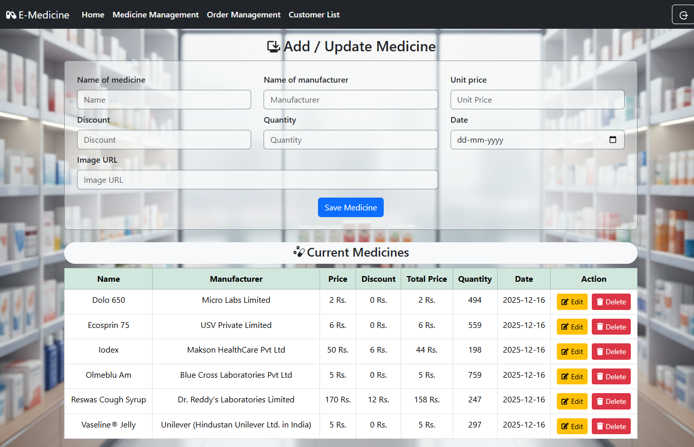
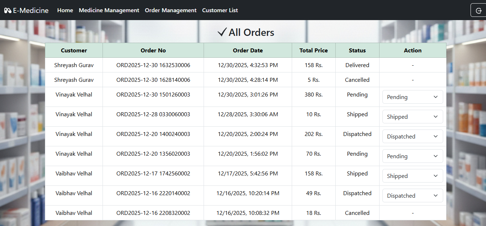
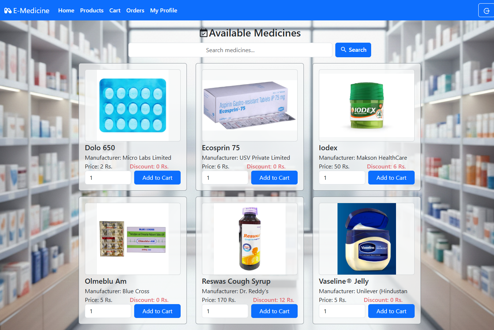
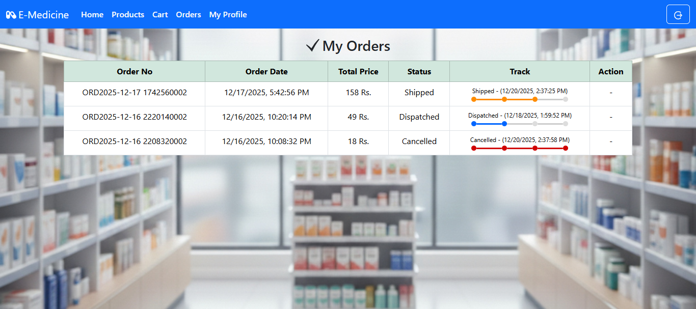

# 📘 E-Medicine – Full-Stack Medicine Ordering Web Application

A full-stack web application where customers can browse medicines, add items to cart, place orders, and admins can manage medicines.
Built using React (Vercel) + ASP.NET Core Web API (Azure) + SQL Server (Azure Database).

---

## 🚀 Live Demo

- Frontend (Vercel): https://e-medicine-system.vercel.app/

- Backend API: Hosted on Microsoft Azure
- Database: SQL Server on Azure  

---
0

## 🛠️ Tech Stack
### Frontend (React)

- React.js (Vite)

- Bootstrap 5

- Axios for API calls

- React Icons

- Hosted on Vercel

### Backend (ASP.NET Core Web API)

- C#

- Entity Framework (or ADO.NET)

- JWT Authentication (Login/Register)

- Hosted on Azure App Service

### Database

- SQL Server

- Stored Procedures

- Hosted on Azure SQL Database  

---

## 📌 Features
### 👤 Customer Module

- View all available medicines

- Search medicines

- Check price, discount, manufacturer

- Add items to cart

- Quantity validation

- Place orders

- View order history

### 🛒 Shopping Cart

- Increase / decrease quantity

- Automatic quantity validation

- Stock availability checks

- Prevents negative or invalid values

### 🔑 Authentication

- Customer Login

- Admin Login

- JWT-based authentication

### 🧑‍⚕️ Admin Module

- Add / Update / Delete medicines

- Update quantity, price, discount

- Upload medicine Image URL

- View list of all medicines

### 📦 Database

- All medicines stored in SQL Server

- All orders stored with total price

- Stored procedures for efficiency

## 📡 API Endpoints (Summary)
### Auth

- POST /User/login

- POST /User/register

### Customer

- GET /Medicines/medicineList

- POST /Medicines/addToCart

- GET /Medicines/cartList

- POST /Medicines/placeOrder

### Admin

- POST /Admin/addUpdateMedicine

- POST /Admin/deleteMedicine

- GET /Admin/orderList  

---

## 📷 Screenshots
### Admin Dashboard

### Medicine List

### Order Management
  
### User Dashboard
  
### Product List

### User Orders
 

---

## 📬 Author
Vinayak Velhal  

---

⭐ If you like this project, please give it a star!